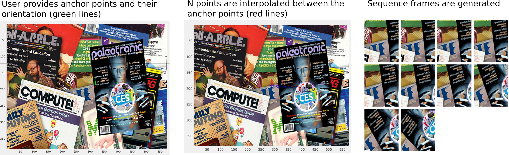

# camera_movement_emulator
Matlab code to emulate realistic camera movement following a given trajectory. By
averaging the generated images for example motion blur can be simulated.

The main function is *computeframes2d.m* and its work horse *tools/evex_imtrans.m*
that generates the images.

This code has been used in the following scientific article where the test sequences
were generated using this code:

 * Image Based Quantitative Mosaic Evaluation with Artificial Video (P. Paalanen, J.-K. Kamarainen and H. Kälviäinen), In Scandinavian Conf. on Image Analysis (SCIA2009), 2009. [PDF](https://webpages.tuni.fi/vision/data/publications/scia2009_mosaic.pdf)


Authors:
 * [Pekka Paalanen](https://ppaalanen.blogspot.com/) - Original code for the publication
 * [Joni Kamarainen](https://github.com/kamarain/) - "Refreshed" old code for this repo and also maintains this repo

## Interactive demo

With the interactive demo you can generate a sequence of artificial video defined by
manually entered path that includes image center points and camera angles. Just run

```
$ nice matlab -nodesktop -softwareopengl
>> addpath tools
>> demo_interactive_conf
>> demo_interactive
```

and the demo will instruct you through. The code helps you to understand the
functionality (have a look inside this demo code).


